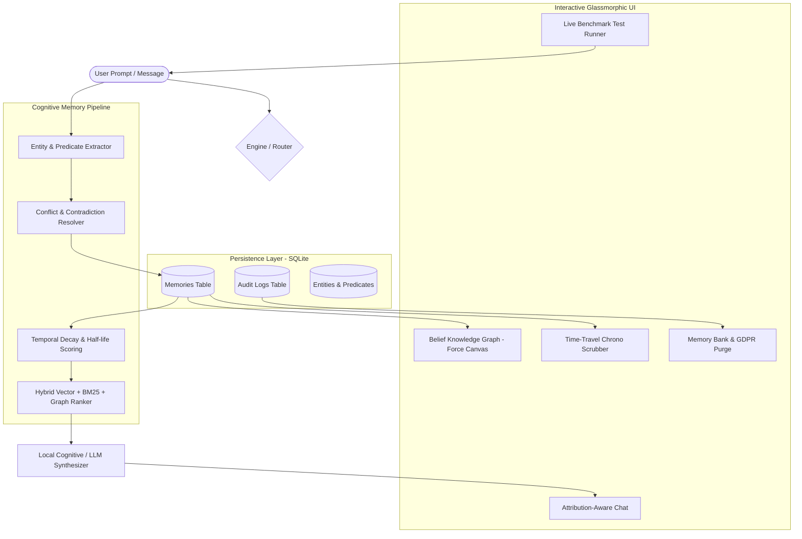

# MemoryOS: The Persistent & Contradiction-Aware AI Assistant

> **"A standard search engine finds facts. MemoryOS tracks the continuous evolution of truth over time."**

MemoryOS is a next-generation cognitive AI assistant built for the track **"The Assistant That Never Forgets... Or Does It?"**. Rather than naively dumping text into an uncurated vector store and retrieving noisy, stale chunks, MemoryOS implements a complete **Cognitive Belief Architecture** that tracks people, evolving preferences, architecture decisions, temporal validity, and belief mutations across sessions and users.

---

## 🌟 Core Innovations & Track Requirements Fulfillment

### 1. 🧠 True Cross-Session Persistence
- Backed by persistent SQLite with normalized schemas for memory entries, entities, validity intervals, and cryptographic audit logs.
- Closing, restarting, or reopening the app preserves full state, historical evolution, and audit trails.
- Zero data loss across server restarts.

### 2. ⚡ Contradiction Resolution & Temporal Mutation Engine
- Detects mutually exclusive assertions across conversation sessions (e.g. *Day 1: "I live in Seattle"* ➔ *Day 3: "I moved to Tokyo"*).
- Uses predicate canonicalization and single-valued exclusivity rules (e.g., `lives_in`, `primary_beverage`, `dietary_lifestyle`, `database_choice`, `framework_choice`).
- Automatically marks older memories as `SUPERSEDED`, links them to the new memory (`superseded_by_id`), records closed validity intervals (`[valid_from, valid_to]`), and logs the causal supersede reason.

### 3. ⏳ Intelligent Memory Lifecycle Policy (What to Keep, Update, Decay, Forget)
| Memory Type | Retention Policy | Half-Life | Contradiction Behavior |
| :--- | :--- | :--- | :--- |
| **Profile Fact** | Permanent until updated | 365 Days | Superseded by newer factual assertions |
| **Decision** | Retained with architectural rationale | 180 Days | Superseded when new decision explicitly recorded |
| **Preference** | Active until explicit reversal | 90 Days | Replaced upon taste changes (*"I quit coffee, now drink matcha"*) |
| **Event** | Temporal validity bounded | 7 Days | Automatically transitions to `EXPIRED` post-date |
| **Ephemeral** | Rapid decay | 2 Days | Filtered out of active context during ranking passes |

### 4. 🔍 100% Explainable Attribution Trace
Every response provides full cognitive visibility:
- **Active Memories Used**: Memory IDs, raw text, predicate, confidence, similarity score, and validity window.
- **Superseded Memories Filtered**: Explains why stale facts were rejected.
- **Conflict Resolution Reason**: Shows the exact causal link that resolved contradictory beliefs.
- **Query Latency**: Measured in milliseconds for real-time responsiveness.

### 5. 🛡️ Multi-Tenant Privacy Isolation
- Strict partition by `user_id` (`riku`, `vansh`, `sid`).
- Mathematical barrier prevents cross-tenant memory contamination (e.g., Riku's confidential project *Project Chimera* is completely invisible to Vansh).

### 6. 🗑️ GDPR Right-to-be-Forgotten & Immutable Audit Trail
- Targeted selective forgetting by query or memory ID (*"Forget my phone number"*).
- Cryptographically timestamps and hashes deletions into an immutable SQLite audit log with purge reason and deleted memory ID.

---

## 🏗️ Architecture



---

## 🚀 Quick Start

### Prerequisites
- Python 3.9+ (`uv` or `pip`)

### Option A: 1-Click Launch Script (macOS / Linux)
```bash
chmod +x run.sh
./run.sh
```

### Option B: 1-Click Launch Script (Windows)
```powershell
.\run.bat
```

### Option C: Manual Launch
```bash
# 1. Install dependencies
pip install -r requirements.txt

# 2. Run backend (FastAPI serves both API and static web UI)
PYTHONPATH=. uvicorn backend.app:app --host 127.0.0.1 --port 8000 --reload
```

Open your browser to: **`http://127.0.0.1:8000`** (or `http://localhost:5173` if running Vite dev server).

---

## 🧪 Automated Test Suite

Run the full pytest test suite with:
```bash
PYTHONPATH=. pytest backend/tests/test_memory.py -v
```

### Test Coverage Summary:
- `test_store_persistence`: Verifies SQLite storage, retrieval, update, and search.
- `test_contradiction_relocation`: Verifies Seattle ➔ Tokyo state mutation and `SUPERSEDED` status.
- `test_diet_contradiction`: Verifies Keto ➔ Vegan preference reversal.
- `test_multi_user_isolation`: Verifies mathematical privacy isolation across tenants.
- `test_gdpr_forget_and_audit_log`: Verifies selective deletion and audit trail generation.
- `test_temporal_decay_lifecycle`: Verifies half-life decay and simulated date transitions.
- `test_retrospective_past_query`: Verifies memory retrieval for questions asking about past states.
- `test_hybrid_retrieval_ranking`: Verifies dense similarity + BM25 keyword weighting.
- `test_attribution_trace_structure`: Verifies explainability attribution payload.

---

## 🎯 4 Live Interactive Judge Benchmarks

Navigate to the **"Judge Benchmarks"** tab in the UI to run 1-click end-to-end verification suites:

1. **Benchmark 1: Relocation Contradiction**
   - Ingests Day 1 *"I live in Seattle"* and Day 3 *"I moved to Tokyo"*.
   - Queries current city and verifies Tokyo is returned with Seattle marked `SUPERSEDED`.
2. **Benchmark 2: Dietary Preference Reversal**
   - Ingests Day 1 *"I follow a strict Keto diet"* and Day 30 *"I gave up keto and am strictly vegan"*.
   - Queries dinner recommendation and verifies Vegan is recommended with Keto superseded.
3. **Benchmark 3: Multi-User Privacy Barrier**
   - Ingests confidential project for Riku.
   - Switches to Vansh, queries secret project, and verifies zero memory leakage.
4. **Benchmark 4: Targeted GDPR Purge**
   - Ingests phone number, triggers targeted forget request, and verifies phone is erased and audit receipt recorded.

---

## 🔌 API Endpoints Reference

| Method | Endpoint | Description |
| :--- | :--- | :--- |
| `POST` | `/api/chat` | Main cognitive chat endpoint with attribution trace |
| `GET` | `/api/memories` | Retrieve memories filtered by user, status, type, query |
| `POST` | `/api/memories/manual` | Directly inject a structured memory entry |
| `DELETE` | `/api/memories/{id}` | Delete a specific memory entry |
| `POST` | `/api/forget` | Targeted GDPR forgetting by topic or natural language query |
| `GET` | `/api/knowledge-graph` | Fetch nodes and edges for dynamic Canvas visualization |
| `GET` | `/api/timeline` | Fetch chronological mutation timeline and valid intervals |
| `GET` | `/api/audit-logs` | Retrieve immutable GDPR deletion logs |
| `GET` | `/api/stats` | Retrieve real-time memory metrics (active, superseded, expired) |
| `POST` | `/api/reset` | Reset tenant memory store to clean seed data |
| `GET` | `/api/users` | List available simulated tenants |

---

## 🎨 Design System & UI
- **Cyberpunk / Glassmorphic dark aesthetic** with glowing emerald/cyan/amber accents.
- **Physics Knowledge Graph** with interactive node dragging, velocity physics, and zoom/pan canvas.
- **Time-Travel Slider** allowing users to inspect what the assistant believed at any timestamp in history.
- **Cognitive Inspector** with memory card inspector, importance meters, and manual memory injection.
- **Inference Provider Toggle** supporting offline zero-dependency local reasoning, Google Gemini, and OpenAI.
